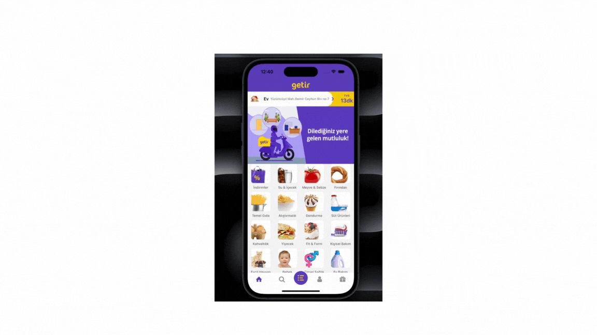

# Getir Clone

- React Native: Mobil uygulama geliştirme için kullanıldı, böylece hem iOS hem de Android platformlarında çalışabilir bir uygulama elde edildi.
  Bu projeyi geliştirirken modern mobil teknolojileri hakkında çok şey öğrendim ve uygulamalı deneyim kazandım. Ayrıca, kullanıcı deneyimini ön planda tutarak işlevsel ve estetik bir uygulama oluşturmanın önemini daha iyi anladım.

## Kütüphaneler

- react-native
- react-native-gesture-handler
- react-native-safe-area-context
- react-native-screens
- react-redux
- redux
- redux-devtools-extension
- redux-logger
- redux-thunk
- @react-navigation/bottom-tabs
- @react-navigation/native
- @react-navigation/stack
- expo
- expo-status-bar

